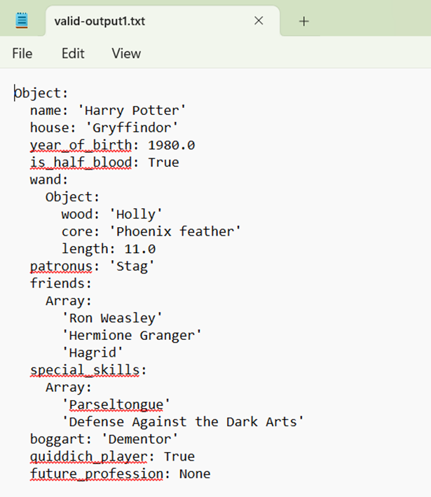

# A JSON Compiler (Frontend)
This project implements a **recursive-descent parser** using Python for the frontend of a basic JSON compiler. The parser processes JSON token streams from .txt files and produces **Abstract Syntax Trees (ASTs)** based on the JSON grammar (refer to the Documentation for the exact grammar).

Below is an output example for a syntactically and semantically correct input (see valid-input1.txt in the "Test Inputs" directory for the input):

## How to run the parser
* Download or clone the project files to your computer
* Place the .txt files containing your input token streams in the same directory as Scanner.py and Parser.py
* Run the Parser.py file using your terminal or command prompt
* When prompted, enter the name of your input file and your desired name for the output file, which will then be created and stored in the same directory

## Assumptions
* The input contains only valid characters

## Author Information
* Name: Nafisah Nubah
* Email: nafisahnubah@gmail.com